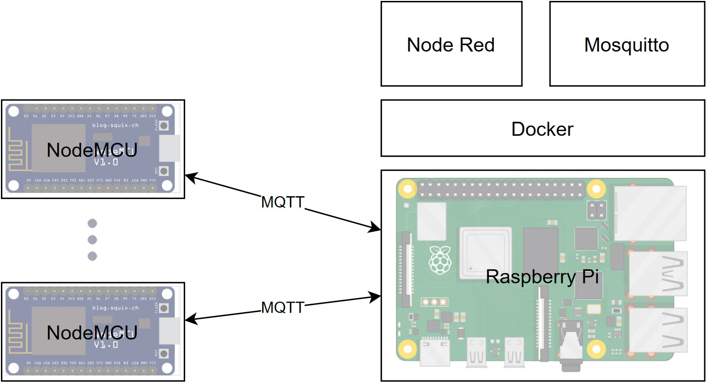

# Central heating automation overview
Here I will give a short overview of how things were before, what problems I encountered and my solution to those problems which ultimately led to this project as a whole.

## How things were
Starting out I had a heat pump controlled by remote which provided hot water to heating elements in each room, each controlled by an analog thermostat. Turning the system on required going to the room with the heat pump controller, turning it on, turning the pump on and then going to each room to set the temperature on each heating element. This was quite problematic so I wanted centralized and automated control to this process.

## The solution
In this section I will discuss the solution I arrived at after many redesigns, details about the challenges will be provided in the sections below. 
### The components

### Rasberry Pi
The Pi is the central hub to which all the NodeMCUs connect. The nodes and the Pi must all be on the same network and the Pi must have a static IP address in order to be found by the nodes.

The Pi runs Docker on top of which run two containers - Node Red and Mosquitto.

Node Red contains all the logic needed to run the heating system automatically. I went with Node Red as it supports all the needs for this project and it is very simple to change things as you are dealing with visual programming. Node Red in turn connects to the MQTT broker (Mosquitto in this case) to communicate with all the nodes on the network.

Mosquitto on the other hand serves as the MQTT broker to which all the nodes connect as well as the Node Red instance.

### NodeMCU
NodeMCUs have become really cheap an they have great community support both for libraries and issue solutions. Each node runs code that reads ambient temperature with the DS18B20 temp sensor. The readings are sent to Node Red via the MQTT protocol which then decides when each room heater is turned on or off.

## Difficulties
The first time I configured everything I wasn't using Docker nor did I have a central repository with everything I needed in it. This resulted in a number of problems - whenever something would break on the Raspberry Pi I had to reconfigure everything, also the data that the apps used wasn't backed up anywhere. This is why I decided to package everythig with Docker and have it in a single repository. Now all I have to do to setup everyting on a new hardware is clone the repo, flash the NodeMCUs, run the docker-compose file and I'm done. This is especially important as all these components run a heating system - an unfunctional controller system means a cold house.

## How it all works
Most of these things I mentioned in the sections above, but here I will explain how a working system runs all in one take.

In order for the system to start I specified a weekly schedule in Node Red. At the appropriate time the Node Red app sends an 'on' command to a NodeMCU with an infrared transmiter which simulates the heat pump's remote, it also starts the water pump at the same time through a relay. Each room heater (heating element) has a weekly schedule which can be independantly configured. At the set time each room heater is started by Node Red which sends 'on' signal via MQTT if the room temp is below the setpoint for that time. After this the nodes send a temperature reading to the Node Red app every n seconds allowing the app to decide when to send on and off commands. For ease of use I also added a UI in Node Red so you can control the system and room temps though a web app.